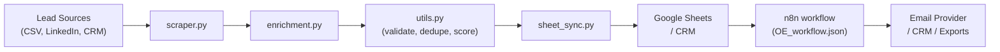
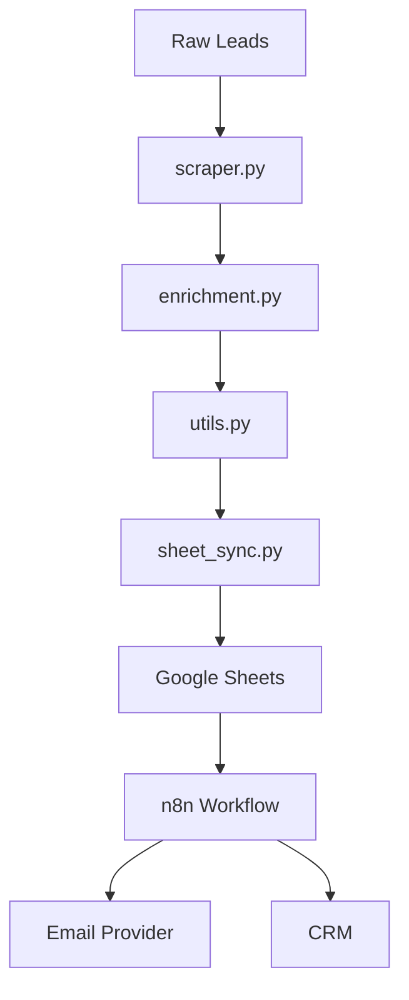
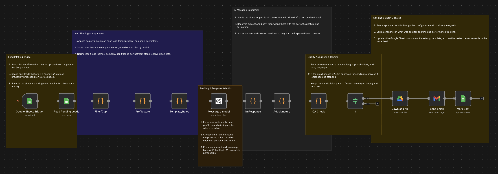
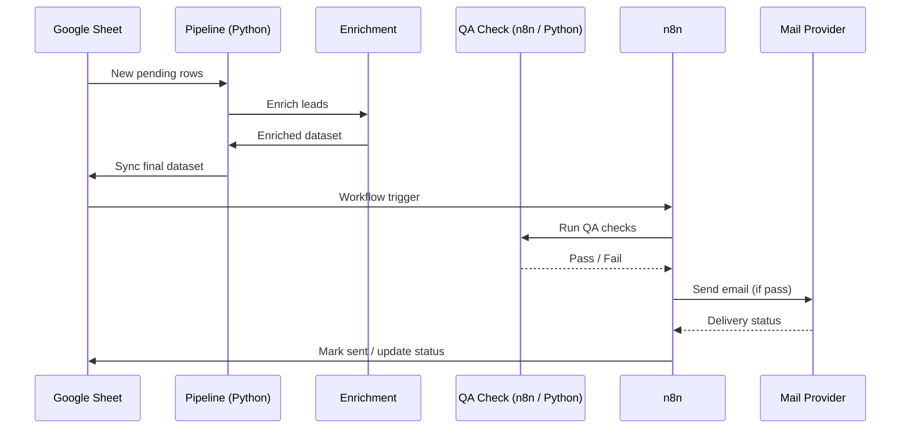

# Outreach Engine (n8n + Python)

[](https://example.com)
[](https://www.python.org/)
[](./LICENSE)
[](https://github.com/aarjunm04/Outreach_Engine_n8n)

One-sentence tagline: A configurable, end‑to‑end B2B outreach engine — ingest, enrich, validate, score, sync, and automate personalized outreach using Python + n8n.

---

## Table of contents

- [Visual overview](#visual-overview)
- [Project history & motivation](#project-history--motivation)
- [System architecture & design](#system-architecture--design)
- [End‑to‑end flow (walk‑through)](#end-to-end-flow-walk-through)
- [Quick start — run in < 10 minutes](#quick-start--run-in--10-minutes)
  - [Local (Python-only)](#local-python-only)
  - [Docker + n8n](#docker--n8n)
- [Configuration & secrets (what to create locally)](#configuration--secrets-what-to-create-locally)
- [Usage examples](#usage-examples)
- [Diagrams & workflow screenshot](#diagrams--workflow-screenshot)
- [Contributing & roadmap](#contributing--roadmap)
- [Best practices & tips](#best-practices--tips)
- [License & contact](#license--contact)

---

## Visual overview

High-level summary:
- Ingest leads (CSV / LinkedIn / CRM exports)
- Enrich and validate leads
- Score and prioritize leads
- Sync to Google Sheets or CRM
- n8n reads synced data and sends personalized outreach + follow-ups

Quick ASCII:
Lead sources → `src/scraper.py` → `src/enrichment.py` → `src/utils.py` (validate/score) → `src/sheet_sync.py` → Google Sheets → n8n → Email / CRM / Exports

Mermaid architecture (GitHub-friendly labels):



---

## Project history & motivation

Why this exists
- Manual outbound outreach is slow, inconsistent, and hard to iterate on.
- Outreach Engine centralizes ingestion, enrichment, and automation so teams can run reproducible, data-driven campaigns.

Key milestones
1. Initial Python prototype for scraping + CSV generation.
2. Added enrichment layer (external APIs + local heuristics).
3. Integrated n8n for orchestration; workflows exported to JSON for version control.
4. Dockerized for easier local deployment and n8n persistence.
5. Modularized code into ingestion, enrichment, validation, and sync components.

Design choices
- Keep n8n workflow definitions in `workflows/` (OE_workflow.json) for version control.
- Separate responsibilities by module so providers and targets are swappable.
- Config-driven mapping and scoring to minimize code changes for policy updates.

---

## System architecture & design

Folder / file overview

| Path | Purpose |
|------|---------|
| src/ | Core Python modules |
| src/main.py | CLI entry - runs pipeline steps |
| src/scraper.py | Ingests & normalizes lead sources |
| src/enrichment.py | Calls enrichment APIs + caching |
| src/sheet_sync.py | Sync to Google Sheets / CRM |
| src/utils.py | Validation, dedupe, scoring helpers |
| config/ | Query templates, field mapping, scoring defaults (non-secret) |
| workflows/ | n8n workflow exports (OE_workflow.json) |
| notebooks/ | Experiments, scoring, EDA |
| data/ | raw, enriched, output snapshots, logs |
| run_pipeline.sh | Convenience script to run the full pipeline |
| OE_workflow.png | n8n workflow screenshot (repo root) |

Component responsibilities

- `scraper.py`: read CSV/exports, normalize fields, produce standardized raw output to `data/raw/`.
- `enrichment.py`: batch enrichment with caching, rate limiting, retries. Output to `data/enriched/`.
- `utils.py`: validate emails, dedupe, compute priority scoring, shared logging utilities.
- `sheet_sync.py`: write final datasets to Google Sheets and create CSV snapshots in `data/output/`.
- `main.py`: orchestrates pipeline stages; accepts CLI args (`--input`, `--dry-run`, etc.).
- n8n workflow (`workflows/OE_workflow.json`): orchestrates triggers, QA checks, personalization, sending, and marking records as sent.

Component relationship diagram:



---

## End‑to‑End flow (walk‑through)

Example run: user drops CSV → full outreach campaign

1. Lead intake
   - Put `leads.csv` into `data/imports/` or edit the control Google Sheet.

2. Ingestion (`src/scraper.py`)
   - Reads the input, maps columns (from `config/field_mappings.yaml`), normalizes names/titles.
   - Writes `data/raw/leads_YYYYMMDD.csv`.

3. Enrichment (`src/enrichment.py`)
   - Batches leads, queries enrichment providers (Perplexity, Clearbit, etc.), adds company and contact metadata.
   - Writes `data/enriched/leads_enriched_YYYYMMDD.csv`.

4. Validation & scoring (`src/utils.py`)
   - Validates emails, removes duplicates, and assigns a `priority` score based on rules in `config/scoring.yaml`.

5. Sync (`src/sheet_sync.py`)
   - Writes final dataset to the Google Sheet and creates a CSV snapshot in `data/output/`.

6. Orchestration & outreach (n8n → OE_workflow.json)
   - n8n triggers on Google Sheet changes / schedule.
   - Personalization → QA check → Send email → Update sheet (status, timestamp).
   - Follow-ups are handled by n8n conditional and delay nodes; reply detection stops sequences.

Compact flow:
1. Drop CSV → 2. scraper.py → 3. enrichment.py → 4. utils.py → 5. sheet_sync.py → 6. n8n sends emails

---

## Quick start — run in < 10 minutes

### Prerequisites
- Python 3.10+
- pip
- Docker & docker-compose (optional, recommended for n8n)
- n8n (or run via Docker)
- Google Sheets service account for sheet sync
- Enrichment provider API keys (stored locally)

### Local (Python-only)

1. Clone
```bash
git clone https://github.com/aarjunm04/Outreach_Engine_n8n.git
cd Outreach_Engine_n8n
```

2. Virtualenv & deps
```bash
python -m venv .venv
source .venv/bin/activate   # macOS / Linux
# .venv\Scripts\activate    # Windows PowerShell
pip install -r requirements.txt
```

3. Provide local credentials (see Configuration & secrets below).

4. Dry-run (no external calls)
```bash
python src/main.py --input data/imports/sample_leads.csv --dry-run
```

5. Full run
```bash
./run_pipeline.sh
```

### Docker + n8n

1. Start services (assuming a `docker-compose.yml` is available)
```bash
docker-compose up -d
```

2. Open n8n at `http://localhost:5678`
   - Import `workflows/OE_workflow.json` (Workflows → Import).
   - Configure Google & SMTP credentials in n8n UI.
   - Activate / schedule the workflow.

---

## Configuration & secrets (what to create locally)

Important: Secrets are intentionally excluded from the repository. Do not commit credentials.

Create locally:
- Google service account JSON: `config/google_service_account.json` (gitignored).
- Environment variables or secret manager entries:
  - `ENRICH_API_KEY` — your enrichment provider key
  - `PERPLEXITY_API_KEY` — if using Perplexity
  - `GOOGLE_SHEET_ID` — target sheet ID
  - `GOOGLE_APPLICATION_CREDENTIALS` — path to service account JSON
  - SMTP credentials (or configure SMTP inside n8n)

Tracked (safe) configuration:
- `config/field_mappings.yaml`
- `config/scoring.yaml`
- `workflows/OE_workflow.json` (n8n export)

Why secrets are excluded
- Service account JSON and API keys are unique to each environment and must never be committed for security reasons.

---

## Usage examples

One-off enrichment:
```bash
python src/enrichment.py --input data/raw/sample_leads.csv --output data/enriched/sample_enriched.csv
```

Full pipeline:
```bash
./run_pipeline.sh
```

Dry-run:
```bash
python src/main.py --input data/imports/sample_leads.csv --dry-run
```

Import n8n workflow:
- In n8n: Workflows → Import → choose `workflows/OE_workflow.json`
- Configure credentials via n8n's Credentials UI.

Schedule in n8n:
- Open the workflow → set Schedule Trigger node to a cron expression (e.g., daily at 09:00).

---

## Diagrams & workflow screenshot

Primary n8n workflow screenshot (file is present in repo root as `OE_workflow.png`):



Caption: Visual of the primary n8n workflow (`OE_workflow.json`): intake → filter & profile → AI message generation → QA → send & mark-sent.

Sequence diagram (flows between components):



---

## Contributing & roadmap

How to contribute
- Open an issue to discuss features or bugs.
- Fork the repo, create a branch, and submit a PR.
- Keep changes modular; update `workflows/` and `config/` as needed.
- Include tests or a short reproduction where possible.

Roadmap
- Multi-channel outreach (LinkedIn, SMS)
- ML-based scoring (notebooks/experiments)
- Campaign dashboard & reply analytics
- Improved observability (structured logs, metrics)

---

## Best practices & tips

- Never commit secrets — use environment variables or a secrets manager.
- Test enrichment on small batches to manage API usage/costs.
- Use `--dry-run` before enabling sending.
- Version-control n8n workflow exports after changes (store in `workflows/`).
- Keep snapshots in `data/output/` for audit and replayability.

---

## License & contact

- License: MIT — see `LICENSE`
- Repo: `aarjunm04/Outreach_Engine_n8n`
- Description: Cold email automation using Perplexity AI and n8n — completely autonomous

If you want, I can prepare a git patch that replaces the current `README.md` with this file and confirms `OE_workflow.png` is referenced correctly. Would you like that patch, or do you want me to open a PR?
